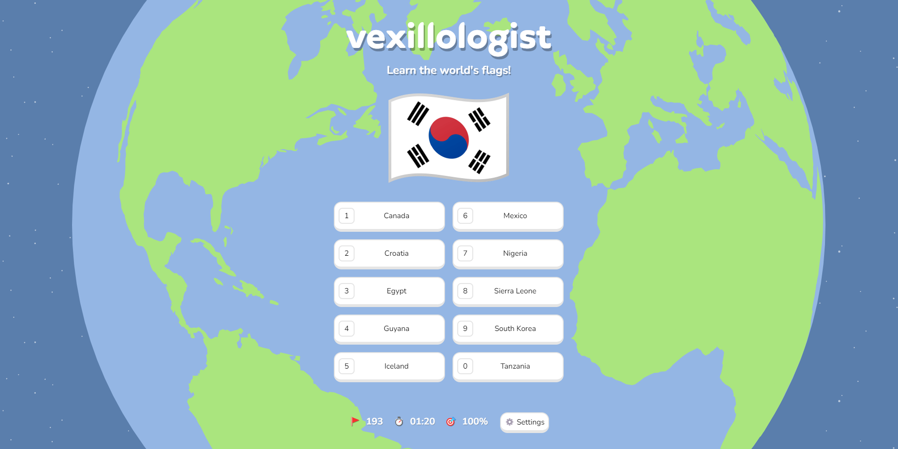

## About
Vexillologist is an educational world flags web game and a beginner front-end development project.

[**Click here to play!**](https://billywojcicki.github.io/vexillologist/)

## How to Play

It's simple - identify the country of the flag shown. All [193 United Nations' member states'](https://www.un.org/en/about-us/member-states) flags are included. Identify every flag to complete the game. Don't worry if you don't know them all, the game is designed to teach you the flags you're unfamiliar with as you progress. Navigate to the settings menu to explore alternate game modes. Happy learning!

## Features

- Multiple choice format
  - Keyboard shortcuts
- Free response format
  - Non case-sensitive
  - Typos with levenshtein distance <= 2 allowed
  - Common name variations accepted, for example:
    - "Côte d'Ivoire" accepts "Ivory Coast"
    - "Czech Republic" accepts "Czechia"
    - "United Arab Emirates" accepts "UAE"
- Capital cities mode
- US states mode
- Player stats
  - Shareable summary displayed at the end of the game
- Interactive globe
  - Draggable on click and hold
  - Color-coded pings display at answer coordinates
- Responsive design
  - Optimized for desktop and mobile-friendly

## Credits

- Flag images from [flagpedia.net](https://flagpedia.net/about)
- Interactive globe made with [planetary.js](http://planetaryjs.com/)
- Confetti animation from [mathusummut](https://github.com/mathusummut/confetti.js)